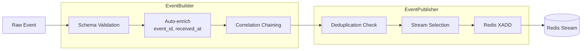
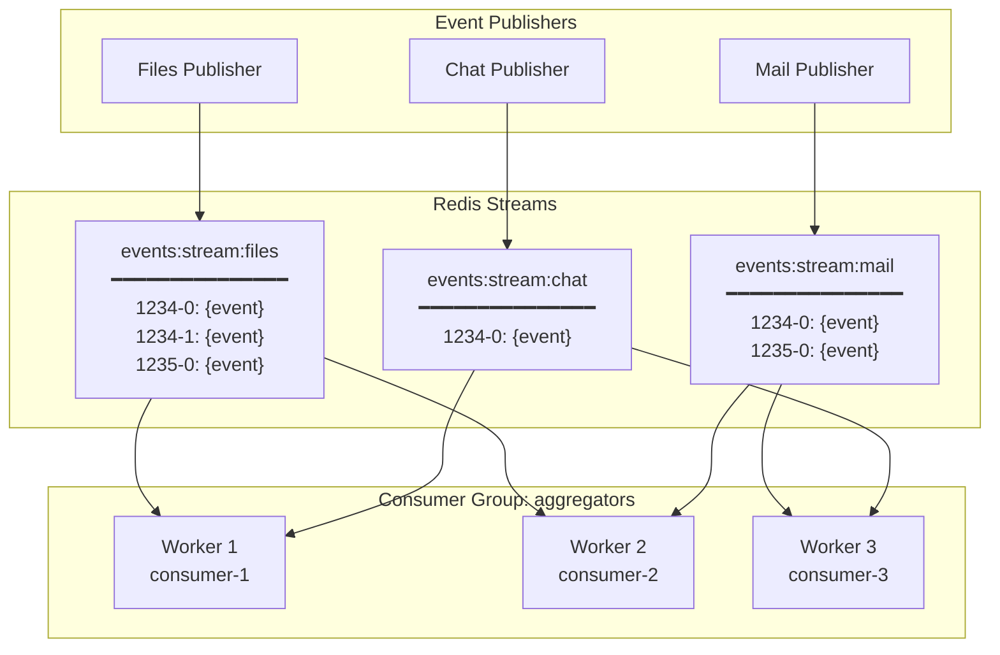
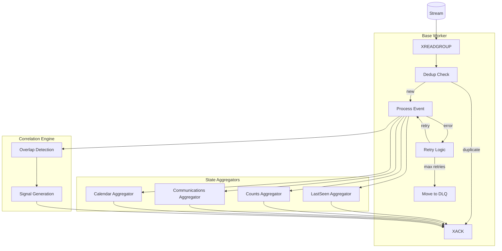
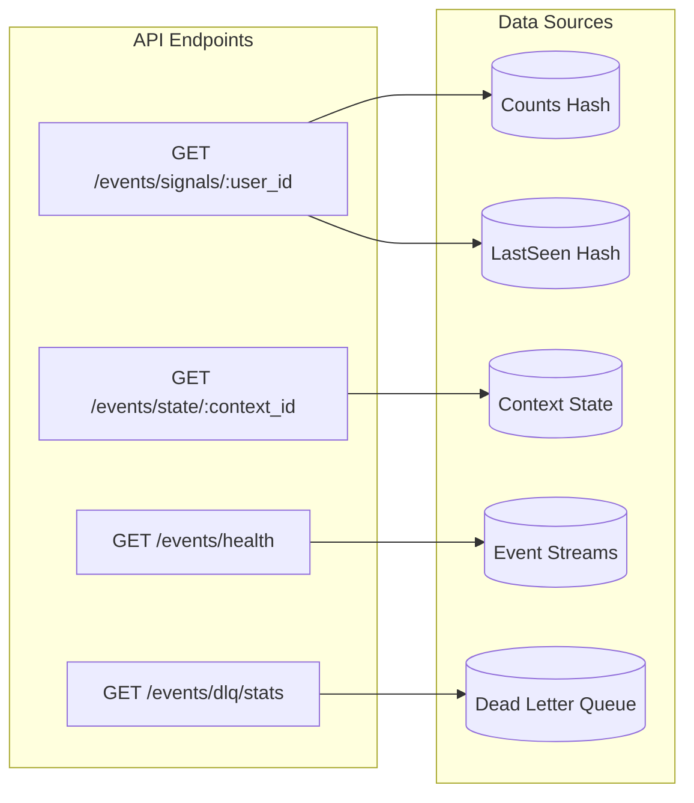
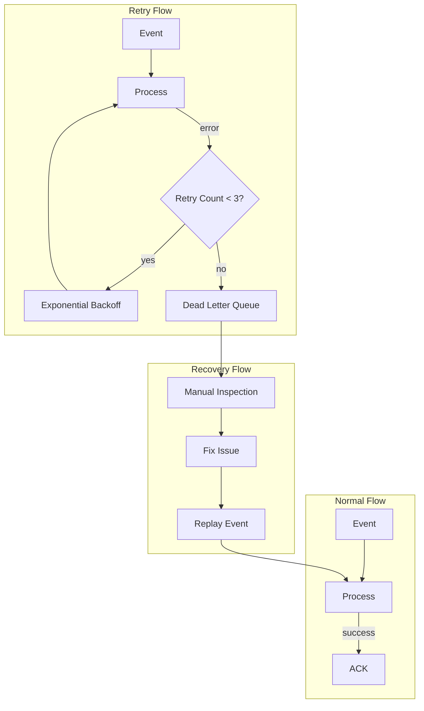
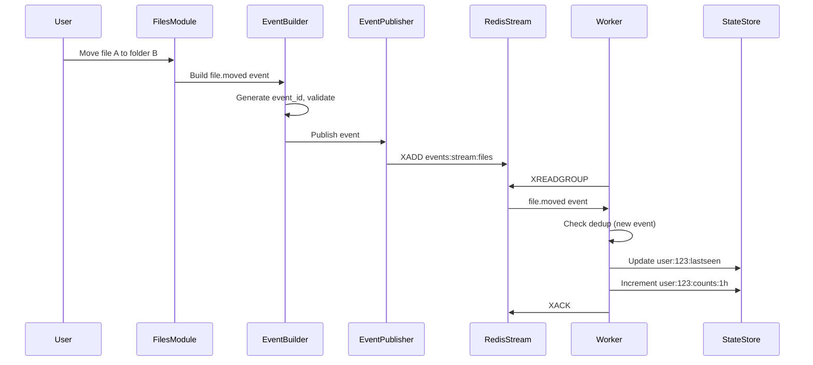
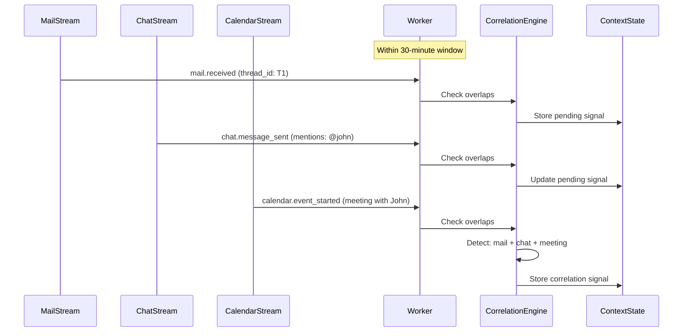
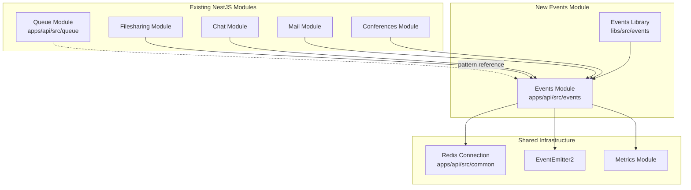
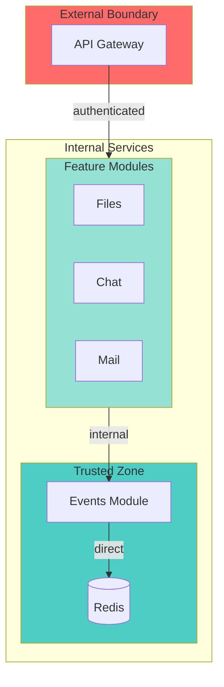

# Event Logging System – Architecture Overview

This document provides a comprehensive overview of the Event Logging System architecture, including component diagrams, data flows, and Redis structures.

## High-Level System Architecture

```mermaid
flowchart TB
    subgraph Sources["Event Sources"]
        FILES[Files Module]
        CONF[Conferences Module]
        MAIL[Mail Module]
        CALDAV[CalDAV Module]
        CHAT[Chat Module]
        HTTP[HTTP Requests]
    end

    subgraph Ingestion["Ingestion Layer"]
        EB[EventBuilder]
        EP[EventPublisher]
        MW[Request Middleware]
    end

    subgraph Redis["Redis Infrastructure"]
        subgraph Streams["Event Streams"]
            S_FILES[events:stream:files]
            S_CONF[events:stream:conferences]
            S_MAIL[events:stream:mail]
            S_CALDAV[events:stream:caldav]
            S_CHAT[events:stream:chat]
        end

        subgraph State["Derived State"]
            LASTSEEN[state:user:*:lastseen]
            COUNTS[state:user:*:counts]
            CONTEXT[state:context:*]
        end

        subgraph Support["Support Structures"]
            DEDUP[events:dedup:*]
            DLQ[events:dlq:*]
        end
    end

    subgraph Workers["Aggregation Workers"]
        CG[Consumer Group]
        AGG[State Aggregators]
        CORR[Correlation Engine]
    end

    subgraph API["Query API"]
        SIGNALS[/signals/:user_id]
        STATE[/state/:context_id]
        HEALTH[/health]
        DLQAPI[/dlq/stats]
    end

    FILES --> EB
    CONF --> EB
    MAIL --> EB
    CALDAV --> EB
    CHAT --> EB
    HTTP --> MW
    MW --> EB

    EB --> EP
    EP --> Streams

    Streams --> CG
    CG --> AGG
    CG --> CORR
    AGG --> State
    CORR --> State

    CG -.->|failures| DLQ
    EP -.->|dedup check| DEDUP

    State --> SIGNALS
    State --> STATE
    Streams --> HEALTH
    DLQ --> DLQAPI
```

## Component Details

### 1. Event Sources

Modules that generate events in the system:

| Source | Event Types | Real Data | Demo Data |
|--------|------------|-----------|-----------|
| Files | file.created, file.moved, file.deleted | Yes | No |
| Conferences | conference.started, conference.ended | Yes | Timestamps only |
| Mail | mail.received, mail.sent, mail.replied | No | Yes |
| CalDAV | calendar.event_created, calendar.event_started | No | Yes |
| Chat | chat.message_sent, chat.message_received | No | Yes |
| HTTP | request.started, request.completed | Yes | No |

### 2. Ingestion Layer



**Components:**

- **EventBuilder**: Constructs events conforming to the canonical schema
  - Auto-generates `event_id` (UUID v4)
  - Sets `received_at` timestamp
  - Validates against JSON Schema
  - Supports correlation_id chaining

- **EventPublisher**: Writes events to Redis Streams
  - Checks deduplication keys before writing
  - Routes to appropriate stream by source
  - Handles connection errors gracefully

- **Request Middleware**: Instruments HTTP requests
  - Generates `request.started` and `request.completed` events
  - Attaches `correlation_id` to request context
  - Captures timing, status, and error information

### 3. Redis Streams Architecture



**Stream Processing Semantics:**

- **At-least-once delivery**: Events may be delivered multiple times
- **Idempotency**: Deduplication via `event_id` ensures safe reprocessing
- **Ordering**: Per-stream ordering guaranteed; cross-stream ordering via timestamps
- **Backpressure**: Consumer groups provide natural backpressure

### 4. Aggregation Workers



**Aggregator Types:**

1. **LastSeen Aggregator**: Tracks last activity per user per source
2. **Counts Aggregator**: Maintains event counts (1h, 24h windows)
3. **Communications Aggregator**: Tracks open mail threads awaiting reply
4. **Calendar Aggregator**: Tracks upcoming conferences by timestamp window
5. **Correlation Engine**: Detects overlapping activity patterns

### 5. Query API



**Endpoints:**

| Endpoint | Description | Data Source |
|----------|-------------|-------------|
| GET /events/signals/:user_id | User activity signals | counts, lastseen |
| GET /events/state/:context_id | Context-derived state | context state |
| GET /events/health | Pipeline health metrics | streams info |
| GET /events/dlq/stats | Dead letter queue stats | DLQ streams |

### 6. Error Handling & Recovery



**Retry Strategy:**
- Max retries: 3
- Backoff: Exponential (1s, 2s, 4s)
- DLQ retention: 7 days
- Replay support via CLI command

## Data Flow Examples

### Example 1: File Move Operation



### Example 2: Correlation Detection



## Integration with Existing Modules



## Security Boundaries



**Security Controls:**
- API key authentication for internal ingestion
- PII field classification and redaction
- No raw mail/chat content in events
- Tenant isolation via `tenant_id`
- Access control per module

## Next Steps

1. **Redis Key Design**: See [redis-design.md](./redis-design.md)
2. **Event Schema**: See [../packages/events/schema/event.schema.json](../../packages/events/schema/event.schema.json)
3. **ADRs**: See [adr/](./adr/) for architectural decisions