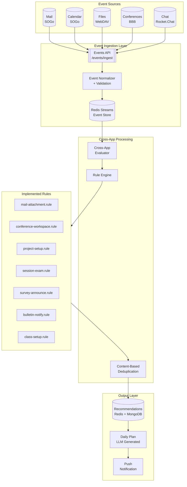
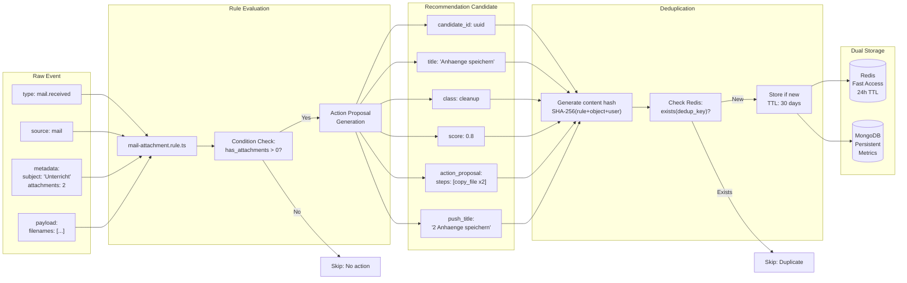
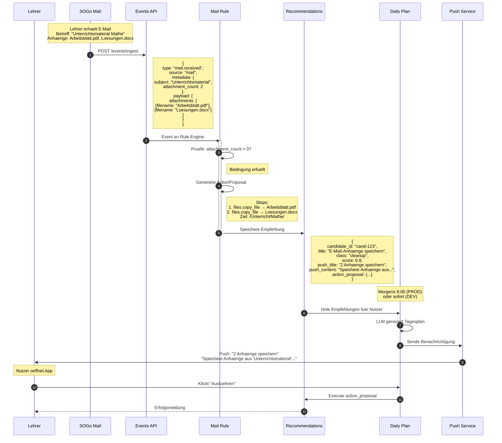
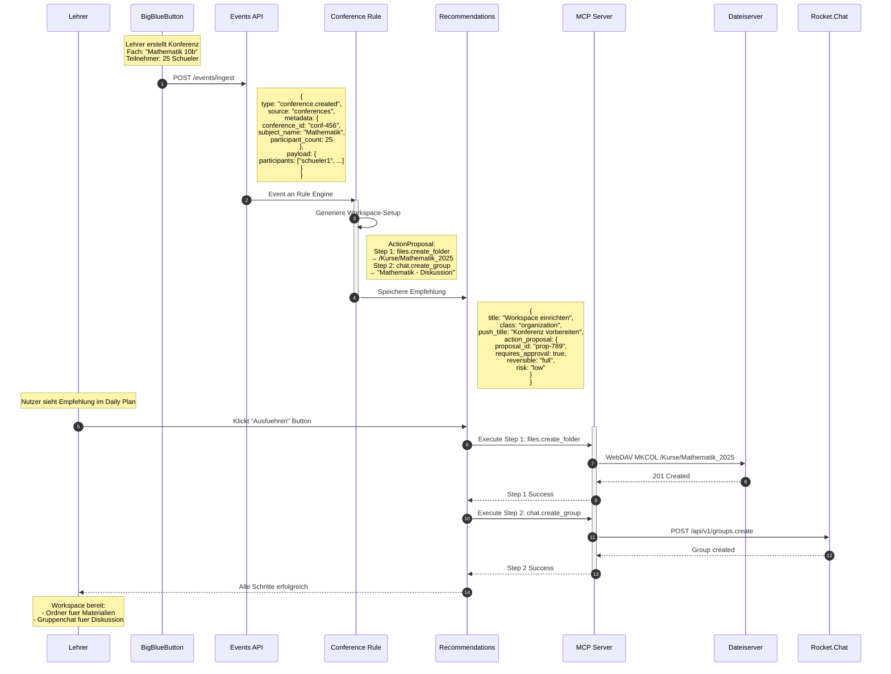
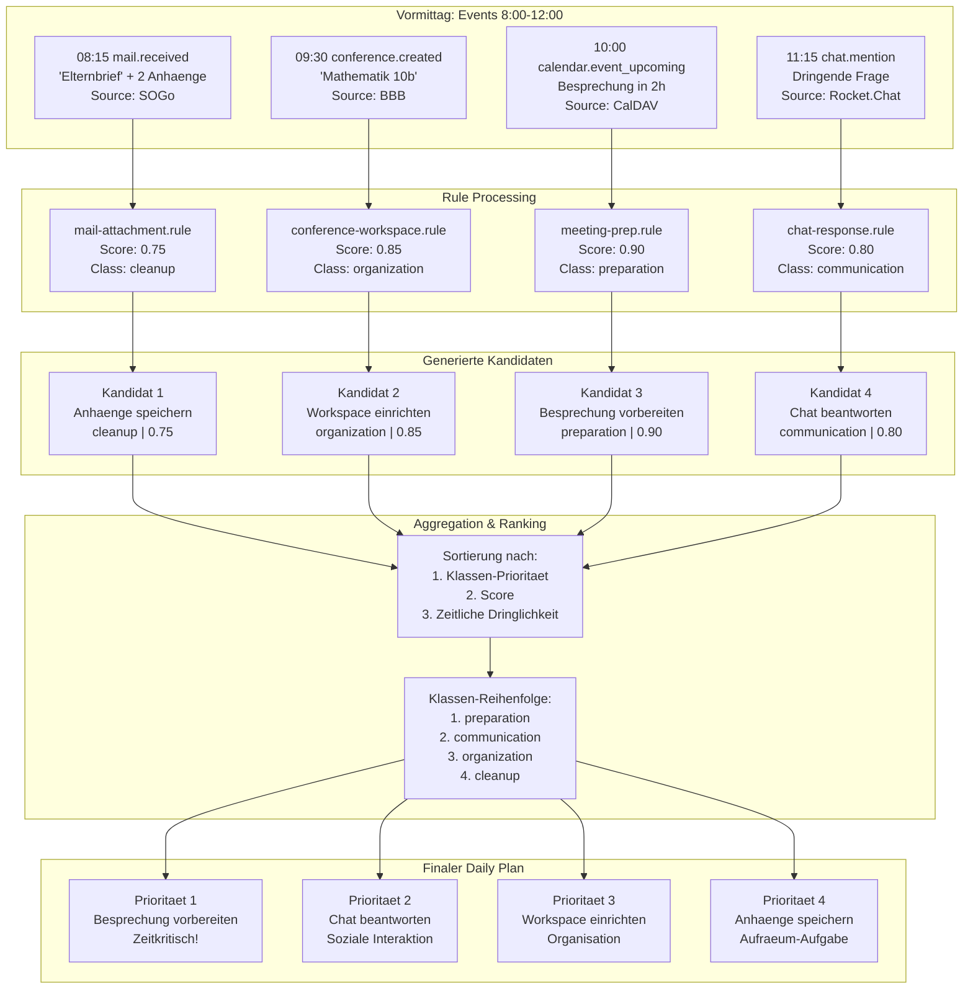
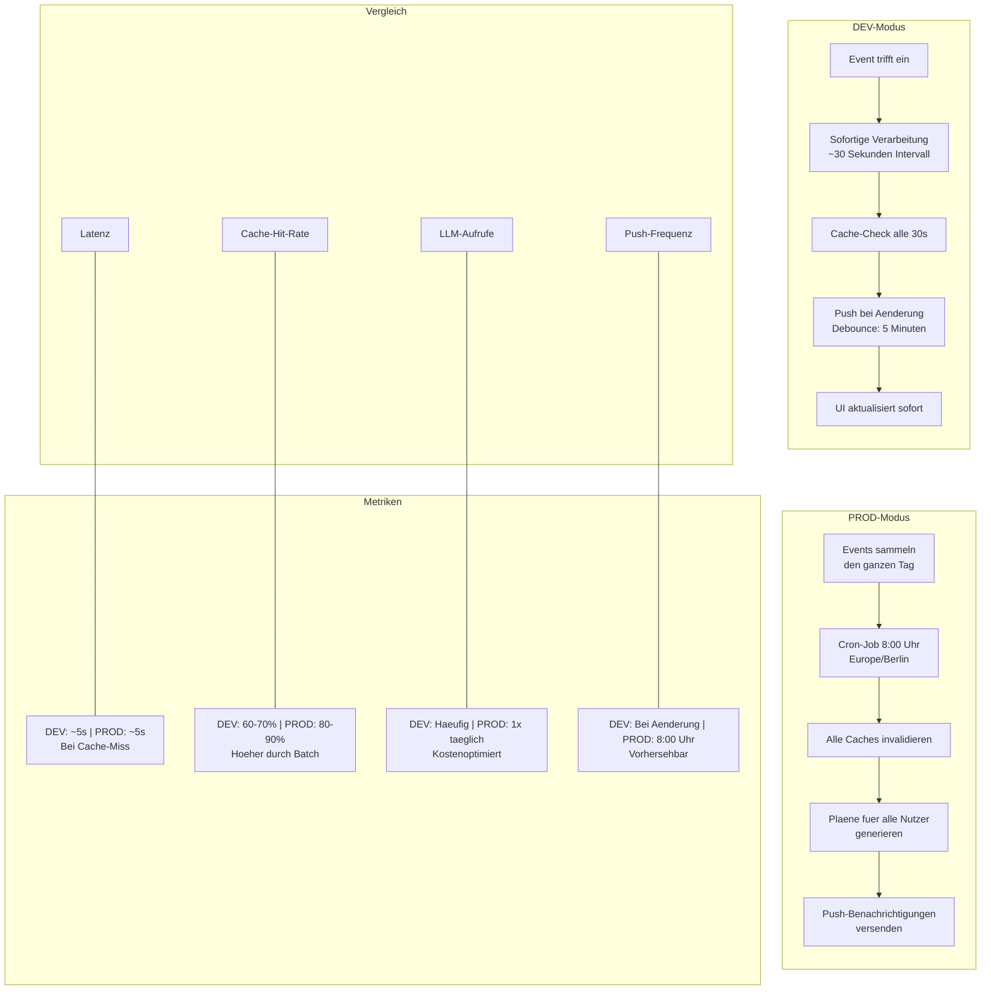
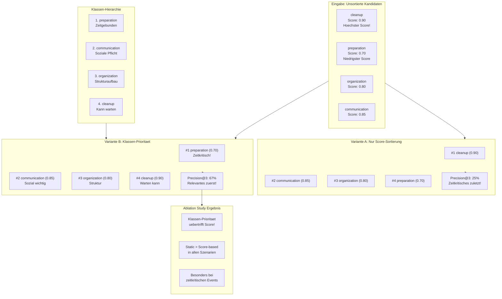
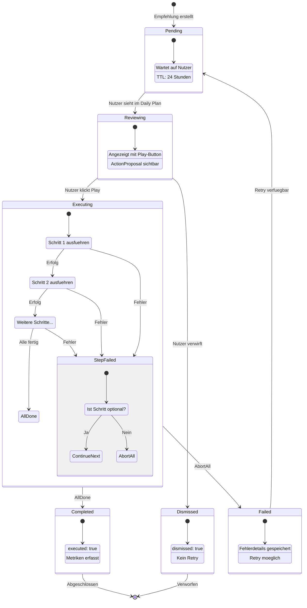
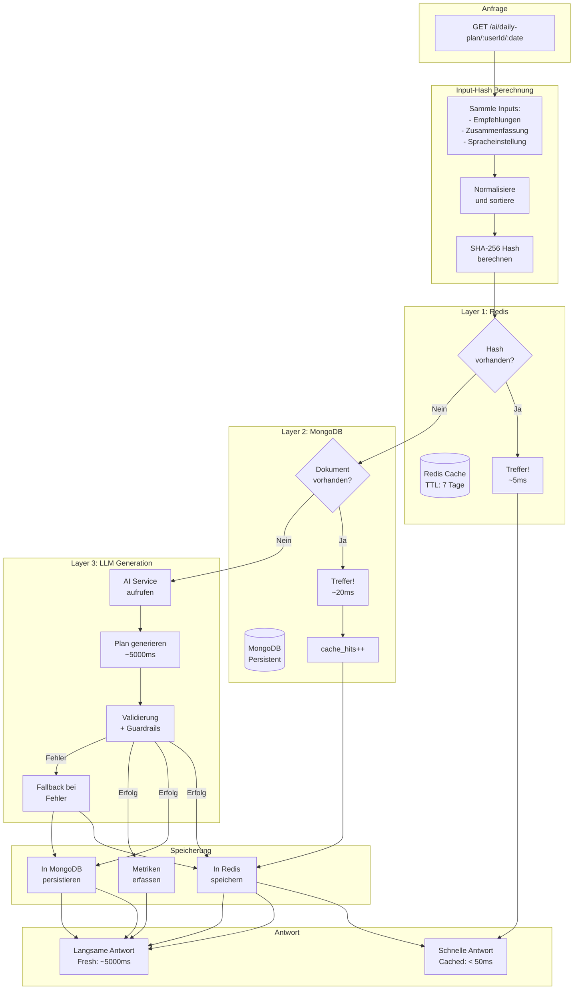

# Thesis Diagrams: Cross-App Intelligence System

**Thesis:** "Cross-App-Intelligenz in Echtzeit: Systementwurf und empirische Evidenz für agentische Personalisierung"

**Autor:** Martin Hummel | **Datum:** 2025-12-21

---

## Inhaltsverzeichnis

1. [Systemarchitektur](#1-systemarchitektur)
2. [Event-zu-Empfehlung Fluss](#2-event-zu-empfehlung-fluss)
3. [Beispiel: E-Mail mit Anhängen](#3-beispiel-e-mail-mit-anhängen)
4. [Beispiel: Konferenz-Workspace](#4-beispiel-konferenz-workspace)
5. [Multi-Source Aggregation](#5-multi-source-aggregation)
6. [Timeline: DEV-Modus](#6-timeline-dev-modus)
7. [Timeline: PROD-Modus](#7-timeline-prod-modus)
8. [DEV vs PROD Vergleich](#8-dev-vs-prod-vergleich)
9. [Klassen-Priorität (Ablation)](#9-klassen-priorität-ablation)
10. [Action Execution Flow](#10-action-execution-flow)
11. [Cache-Strategie](#11-cache-strategie)

---

## 1. Systemarchitektur

**Kapitel:** 3. Systemarchitektur

**Beschreibung:** Zeigt die Gesamtarchitektur des Systems von den Eventquellen über die Verarbeitung bis zur Ausgabe.

**Kernpunkte:**
- 5 primäre Eventquellen (SOGo Mail/Calendar, WebDAV, BBB, Rocket.Chat)
- Zentrale Event-Ingestion via REST API
- 7 implementierte Cross-App Rules
- Multi-Target Output (Empfehlungen, Daily Plan, Push)



---

## 2. Event-zu-Empfehlung Fluss

**Kapitel:** 4. Implementierung

**Beschreibung:** Detaillierte Transformation eines Raw Events zu einem gespeicherten Recommendation Candidate.

**Kernpunkte:**
- Event enthält type, source, metadata
- Rule evaluiert Bedingungen (z.B. has_attachments)
- Action Proposal wird mit ausführbaren Schritten generiert
- Content-basierte Deduplizierung verhindert Duplikate
- Dual Storage: Redis (schnell, 24h) + MongoDB (persistent)



---

## 3. Beispiel: E-Mail mit Anhängen

**Kapitel:** 5. Anwendungsbeispiele

**Szenario:**
- Lehrer erhält E-Mail "Unterrichtsmaterial Mathe" mit 2 PDF-Anhängen
- System generiert Empfehlung zum Speichern der Anhänge
- Push-Benachrichtigung: "2 Anhänge speichern"



---

## 4. Beispiel: Konferenz-Workspace

**Kapitel:** 5. Anwendungsbeispiele

**Szenario:**
- Lehrer erstellt Konferenz "Mathematik 10b"
- System schlägt vor: Ordner + Gruppenchat erstellen
- Nutzer führt Aktionen via MCP Tools aus



---

## 5. Multi-Source Aggregation

**Kapitel:** 4.3 Cross-App Aggregation

**Beschreibung:** Demonstriert Cross-App Aggregation aus mehreren Eventquellen.

**Kernpunkte:**
- 4 Events aus verschiedenen Quellen an einem Vormittag
- Jedes Event generiert einen Recommendation Candidate
- Aggregation sortiert nach Klassen-Priorität (nicht Score!)
- Ablation Study Finding: Klassen-Priorität > Score



---

## 6. Timeline: DEV-Modus

**Kapitel:** 4.4 Betriebsmodi

**Beschreibung:** Zeigt die sofortige Verarbeitung im Entwicklungsmodus.

**Charakteristiken:**
- Events werden sofort verarbeitet
- Keine Batching- oder Scheduling-Verzögerungen
- UI aktualisiert sich innerhalb von Sekunden

```mermaid
gantt
    title DEV-Modus: Sofortige Verarbeitung
    dateFormat HH:mm
    axisFormat %H:%M

    section Events
    Demo-Daten generiert    :e1, 09:00, 1m
    Events aufgenommen      :e2, after e1, 1m

    section Verarbeitung
    Rules ausgewertet       :p1, after e2, 1m
    Empfehlungen gespeichert:p2, after p1, 1m
    Cache invalidiert       :p3, after p2, 1m

    section Ausgabe
    Plan neu generiert      :crit, o1, after p3, 2m
    UI zeigt neue Daten     :o2, after o1, 1m

    section Nutzer
    Sieht Aenderungen       :u1, after o2, 1m
```



---

## 7. Timeline: PROD-Modus

**Kapitel:** 4.4 Betriebsmodi

**Beschreibung:** Zeigt die Batch-Verarbeitung im Produktionsmodus.

**Charakteristiken:**
- Events sammeln sich über den Tag
- Cron-Job um 8:00 Uhr (Europe/Berlin)
- Pläne werden frisch generiert, Push an alle Nutzer

```mermaid
gantt
    title PROD-Modus: Batch-Verarbeitung
    dateFormat HH:mm
    axisFormat %H:%M

    section Vortag
    Events treffen ein      :e1, 14:00, 6h
    Empfehlungen gesammelt  :e2, 14:00, 6h

    section Nacht
    Events laufen weiter    :n1, 20:00, 10h
    Keine Planverarbeitung  :n2, 20:00, 10h

    section Morgen
    Cron-Job 8:00 Uhr       :crit, m1, 08:00, 1m
    Cache invalidiert       :m2, after m1, 1m
    Plaene generiert        :crit, m3, after m2, 5m
    Push gesendet           :m4, after m3, 2m

    section Nutzer
    Push empfangen          :u1, after m4, 1m
    App geoeffnet           :u2, after u1, 5m
    Tagesplan angezeigt     :u3, after u2, 1m
```

---

## 8. DEV vs PROD Vergleich

**Kapitel:** 4.4 Betriebsmodi

**Beschreibung:** Direkter Vergleich der beiden Betriebsmodi.



---

## 9. Klassen-Priorität (Ablation)

**Kapitel:** 6. Evaluation

**Beschreibung:** Visualisiert das zentrale Ablation Study Finding: Klassen-Priorität übertrifft Score-basierte Sortierung.

**Kernaussage:**
- Trotz höchstem Score (0.90) landet "cleanup" auf dem letzten Platz
- "preparation" (Score 0.70) wird zur höchsten Priorität
- Diese Ordnung verbessert die Nutzerzufriedenheit und Aufgabenrelevanz



---

## 10. Action Execution Flow

**Kapitel:** 4.5 Agentische Aktionen

**Beschreibung:** Zeigt die Zustandsmaschine für Action Proposal Execution.

**Zustände:**
- **Pending:** Empfehlung erstellt, wartet auf Nutzer
- **Reviewing:** Nutzer sieht im Daily Plan
- **Executing:** Nutzer hat Play geklickt, Schritte laufen
- **Completed:** Alle Schritte erfolgreich
- **Failed:** Ein oder mehr Schritte fehlgeschlagen (Retry verfügbar)
- **Dismissed:** Nutzer hat Empfehlung verworfen



---

## 11. Cache-Strategie

**Kapitel:** 4.6 Performance

**Beschreibung:** Illustriert das Multi-Layer Caching für Daily Plan Generation.

**Latenz-Vergleich:**

| Quelle | Latenz | Anteil |
|--------|--------|--------|
| Redis | ~5ms | 70% |
| MongoDB | ~20ms | 20% |
| LLM Generation | ~5000ms | 10% |

**Cache Invalidation:**
- Input Hash berechnet aus Summary + Recommendations
- Jede Änderung der Inputs triggert Cache Miss
- Fresh Generation wird in beide Layer gespeichert



---

## Verwendung in der Thesis

### Kapitel-Zuordnung

| Diagramm | Thesis-Kapitel |
|----------|----------------|
| 01 Systemarchitektur | 3. Systemarchitektur |
| 02 Event-zu-Empfehlung | 4. Implementierung |
| 03-04 Konkrete Beispiele | 5. Anwendungsbeispiele |
| 05 Multi-Source Aggregation | 4.3 Cross-App Aggregation |
| 06-08 Timeline-Diagramme | 4.4 Betriebsmodi |
| 09 Klassen-Priorität | 6. Evaluation (Ablation) |
| 10 Action Execution | 4.5 Agentische Aktionen |
| 11 Cache-Strategie | 4.6 Performance |

### Rendering-Hinweise

Diese Diagramme sind in Mermaid-Syntax geschrieben und können gerendert werden:

1. **LaTeX:** Mit `mermaid-cli` zu PDF/PNG exportieren
2. **Markdown:** GitHub/GitLab rendern nativ
3. **Web:** Mit Mermaid.js Library
4. **VS Code:** Mit Mermaid Preview Extension

### Export-Befehl

```bash
# mermaid-cli installieren
npm install -g @mermaid-js/mermaid-cli

# Alle Diagramme zu PNG exportieren
find docs/thesis/diagrams -name "*.mermaid" -exec sh -c \
  'mmdc -i "$1" -o "${1%.mermaid}.png" -t neutral -b white' _ {} \;
```

### LaTeX-Einbindung

```latex
\begin{figure}[h]
  \centering
  \includegraphics[width=\textwidth]{diagrams/architecture/01-system-overview.png}
  \caption{Systemarchitektur der Cross-App Intelligence}
  \label{fig:system-overview}
\end{figure}
```

---

## Dateien

Alle Diagramme sind auch als separate Dateien verfügbar:

```
docs/thesis/diagrams/
├── README.md
├── THESIS_DIAGRAMS.md
├── COMPLETE_DOCUMENTATION.md         # Vollständige technische Dokumentation
├── architecture/
│   ├── 01-system-overview.mermaid
│   └── 02-event-to-recommendation.mermaid
├── examples/
│   ├── 03-mail-attachments.mermaid
│   ├── 04-conference-workspace.mermaid
│   └── 05-multi-source-aggregation.mermaid
├── timelines/
│   ├── 06-dev-mode-timeline.mermaid
│   ├── 07-prod-mode-timeline.mermaid
│   └── 08-dev-vs-prod-comparison.mermaid
├── analysis/
│   ├── 09-class-priority-ablation.mermaid
│   ├── 10-action-execution-flow.mermaid
│   ├── 11-cache-strategy.mermaid
│   ├── 12-complete-event-taxonomy.mermaid   # NEU: Alle 46 Event Types
│   ├── 13-all-rules-overview.mermaid        # NEU: Alle 21 Rules
│   ├── 14-dedup-algorithm.mermaid           # NEU: Deduplizierungs-Algorithmus
│   ├── 15-scoring-algorithm.mermaid         # NEU: Scoring-Formel
│   ├── 16-precision-calculation.mermaid     # NEU: Precision@3 Berechnung
│   └── 17-cross-source-gain.mermaid         # NEU: Cross-Source Gain Rate
└── THESIS_DIAGRAMS.md
```

---

*Dokument generiert: 2025-12-21*
*Thesis: "Cross-App-Intelligenz in Echtzeit: Systementwurf und empirische Evidenz für agentische Personalisierung"*
